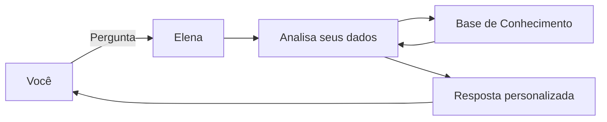

# 🤖 Elena - Agente de Planejamento Financeiro

> Agente inteligente que ajuda pessoas a planejarem e alcançarem suas metas financeiras de forma personalizada e acessível.

## 💡 O Problema

Muitas pessoas têm dificuldade em organizar suas finanças e planejar metas devido à falta de tempo, conhecimento ou ferramentas acessíveis. Isso gera estresse, endividamento e impede o crescimento financeiro.

## ✨ A Solução

**Elena** é uma agente financeira amigável que:
- 📊 Analisa seus gastos pessoais
- 🎯 Ajuda a criar metas financeiras realistas
- 💭 Usa seus próprios dados para exemplos práticos
- 🎓 Ensina conceitos financeiros de forma simples
- ✅ Nunca propõe planejamentos impossíveis de alcançar

## 🏗️ Como Funciona

**Base de dados utilizada:**
- Histórico de transações
- Perfil do investidor
- Produtos financeiros (para exemplos)
- Histórico de atendimentos

## 🎯 Características

✅ **Educativa e paciente** - Explica conceitos sem julgamentos  
✅ **Personalizada** - Usa seus dados reais como base  
✅ **Segura** - Não alucina informações financeiras  
✅ **Acessível** - Linguagem simples e informal  
✅ **Focada** - Especializada apenas em finanças  

## 🚀 Tecnologias

- **Interface:** Streamlit
- **LLM:** Ollama (local)
- **Dados:** JSON/CSV
- **Linguagem:** Python

## 📈 Métricas de Qualidade

| Métrica | Resultado |
|---------|-----------|
| **Assertividade** | ✅ Respostas precisas baseadas nos dados |
| **Segurança** | ✅ Admite quando não sabe algo |
| **Coerência** | ✅ Personalizada ao perfil do usuário |

## 💬 Exemplo de Uso

**Você:** Onde estou gastando mais?  
**Elena:** Olhando suas transações de outubro, sua maior despesa é moradia (R$ 1.380), seguida de alimentação (R$ 570). Juntas, representam quase 80% dos seus gastos. Isso é bem comum! Quer que eu explique algumas estratégias de organização?

## 🎓 Projeto Desenvolvido

Este projeto foi criado como parte do desafio **"Agente Financeiro Inteligente com IA Generativa"** da DIO (Digital Innovation One), focando em:
- Engenharia de prompts
- Integração com LLMs
- Base de conhecimento estruturada
- Estratégias anti-alucinação
- Personalização de agentes de IA

---

**Desenvolvido por:** Eduardo  
**Instituição:** DIO - Digital Innovation One
