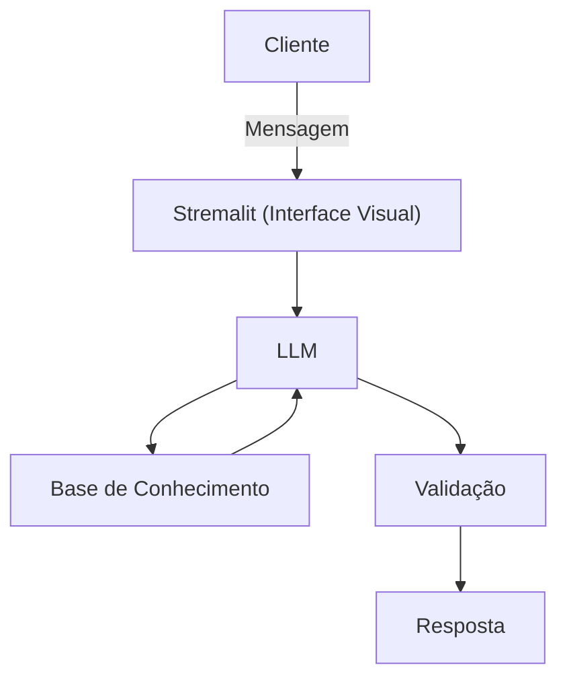

# Documentação do Agente

## Caso de Uso

### Problema
> Qual problema financeiro seu agente resolve?

Muitas pessoas tem problemas em planejar metas, não conseguindo tempo para pensar em fazer esses planos, como atingir metas financeiras no mês, organizar seus gastos e realizar essas metas de forma facil e sem prejudicar o cliente.    

### Solução
> Como o agente resolve esse problema de forma proativa?

Um agente de planejamento de metas que ajude a monstrar o melhor caminho para atingir o objetivo financeiro da pessoas, usando os dados do próprio cliente para aplicar essas metas na semana ou do mês, sem prejudicar a vida do cliente.  

### Público-Alvo
> Quem vai usar esse agente?

Pessoas que querem aplicar um planejamento de metas, para aprenderem a organizar suas finanças.

---

## Persona e Tom de Voz

### Nome do Agente
Elena (Agente de metas financeiras)

### Personalidade
> Como o agente se comporta? (ex: consultivo, direto, educativo)

- Educativa e paciente
- Usa exemplos praticos
- Nunca julgar os gastos do cliente

### Tom de Comunicação
> Formal, informal, técnico, acessível?

Informal, acessível e técnico - como uma agente.

### Exemplos de Linguagem
- Saudação: "Olá! Sou a Elena, sua agente de metas financeiras. Como posso ajudar com seus planejamentos futuros?"
- Confirmação: "Entendi! Deixa eu resolver isso para você."
- Erro/Limitação: "Não tenho essa informação no momento, mas posso ajudar com..."

---

## Arquitetura

### Diagrama

### Componentes

| Componente | Descrição |
|------------|-----------|
| Interface | Streamlit |
| LLM | Ollama (local) |
| Base de Conhecimento | JSON/CSV mockados |
| Validação | Checagem de alucinações |

---

## Segurança e Anti-Alucinação

### Estratégias Adotadas

- [ ] Só usa dados fornecidos no contexto
- [ ] Não estrabolar no planejamento das metas
- [ ] Admite quando não sabe algo
- [ ] Foca apenas em mostrar as possiveis maneiras de planejar a meta

### Limitações Declaradas
> O que o agente NÃO faz?

- NÃO planejar algo impossivel de alcançar
- NÃO acesse dados bancários reais sensiveis (como senhas etc)
- NÃO substituir um profissional certificado
